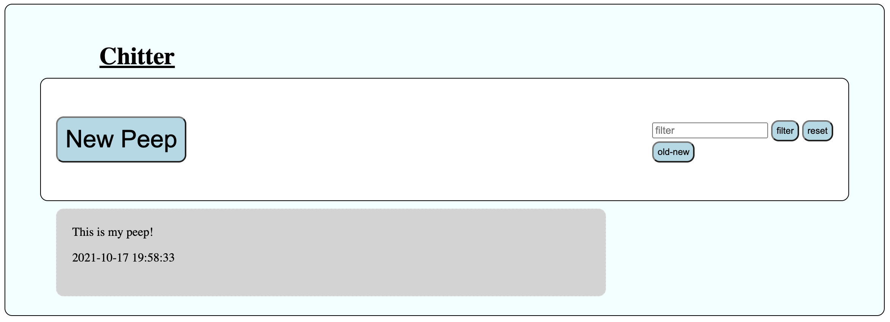
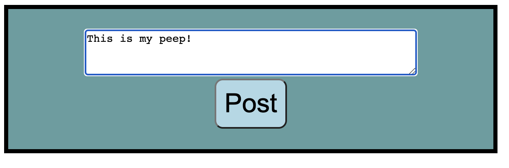

# Chitter

This application is a clone of Twitter. It has a full suite of tests, including 100% code coverage unit tests and feature tests.

## Main page:



## New Peep page:



## Planning

I have planned this app out with a number of diagrams to help the process:

### Class diagram:


### Peep sequence diagram:


I built the app using TDD. First I would write a feature test to cover a user story, then by adding individual unit tests along the process I could maintain a fully tested codebase while adding the functionality to pass the feature test.

I maintained the Single Responsibility principle throughout all my classes. Each class has a specific functionality and using dependency injection I pass all dependencies into the classes without the need for a class to create the instance itself.

## User Stories:

```
As a Maker
So that I can see what people are doing
I want to see all the messages (peeps)
in a browser
```

```
As a Maker
So that I can let people know what I am doing
I want to post a message (peep) to chitter
```

```
As a Maker
So that I can see when people are doing things
I want to see the date the message was posted
```

```
As a Maker
So that I can easily see the latest peeps
I want to see a list of peeps in reverse chronological order
```

```
As a Maker
So that I can find relevant peeps
I want to filter on a specific keyword
```

## Thoughts and comments

While my code does tick all the user story boxes and works fairly well there are a few things I think I would change if I were to continue this project. First of all I would like to add in an authentication system so that users can log in and out to add new posts, but be allowed to view the main feed without.

I also think my filtering and ordering features could be redesigned to work in unison a little better. At the moment if you add a filter then reorder the list it loses the filter. This is also a problem the other way around, if you reorder the list to show the content in chronological order then add a filter it will revert to the default order. The reason I left this is because in the user stories it does not actually ask for the list to be reorderable and instead just says that the order should be reverce chronological. As an experiment I added in the feature to choose the order but that is not specifically what the task asked for. I think it would be fairly staight forward to add some cookies in to remember the filter between page loads or remeber the users choice of the order. But since I had not added user accounts I had not implemented this yet.

All in all this was a good experiment to put to use the things I had learned over the last week, and I am now much mroe comfortable with the main goal of implementing a postgres database into a web app.
