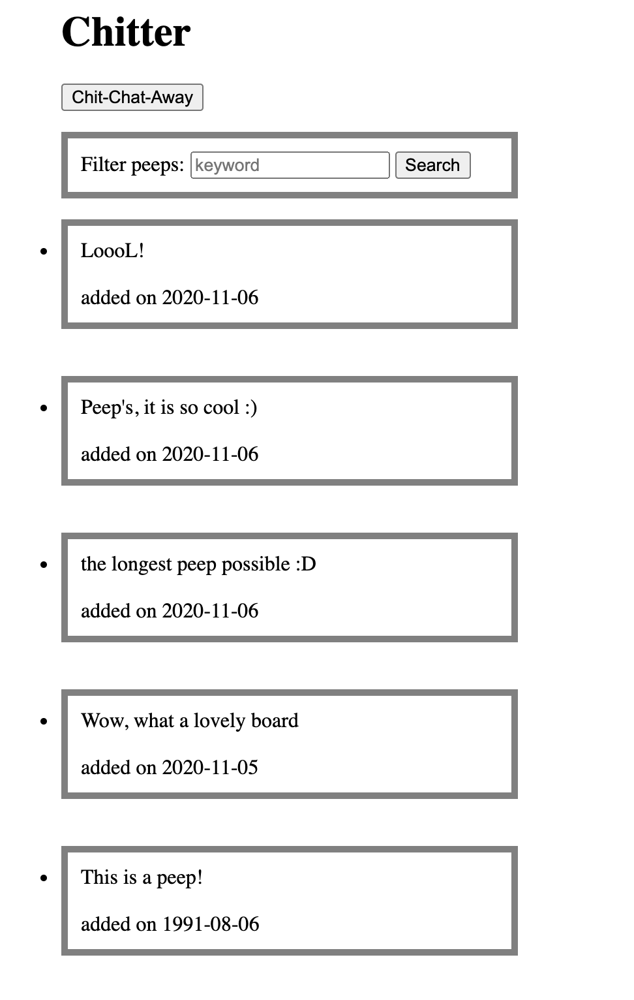
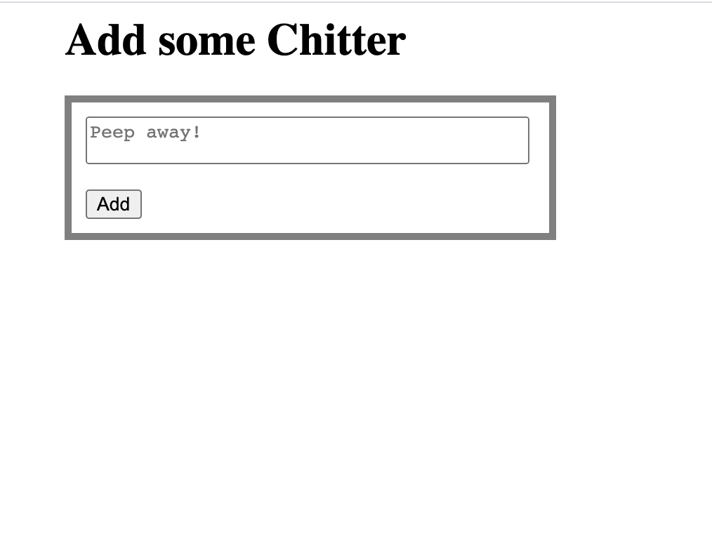

## Chitter Challenge

Write a small Twitter clone that will allow the users to post messages to a public stream.

## Set up

To setup the database:

* Connect to psql
* Create the database using the psql command `CREATE DATABASE chitter;`
* Connect to the database using the psql command `\c chitter`;
* Run the query we have saved in the file 01_create_chitter_table.sql
* Populate your table with a row by running `INSERT INTO peeps (message) values ('This is a peep!');`

To check you have everything set up ok, please take a look at the peeps table inside the chitter database. You should see one row in there.  

To setup the test database:
* Connect to psql
* Create the database using the psql
command `CREATE DATABASE chitter_test;`;
* Connect to the database using the psql command `\c chitter_test`
* Run the query we have saved in the file 01_create_chitter_table.sql

* `bundle install`
* `rspec`

You should see 1 passing test.

## User stories

```
As a Maker
So that I can see what people are doing
I want to see all the messages (peeps)
in a browser
```

```
As a Maker
So that I can let people know what I am doing  
I want to post a message (peep) to chitter
```

```
As a Maker
So that I can see when people are doing things
I want to see the date the message was posted
```

```
As a Maker
So that I can easily see the latest peeps
I want to see a list of peeps in reverse chronological order
```
```
As a Maker
So that I can find relevant peeps
I want to filter on a specific keyword
```
## Outcomes

- Testing and coverage:
Task has been completed in a TDD manner, feature testing with Capybara and unit testing with RSpec was involved. 
The coverage of 99.19% was achieved. 
Additionally, `rubocop` accepts the code as clean.

- Reflection on blockers:
The biggest blocker I have encountered while working on the project, was making sure to wrap Database data in program objects. It took me some time to understand properly how it works, but having to complete pair-programming challenge for this week along with trying to sovle same problem with `Chitter` has in the end made me deeply understand this initial blocker. 
Additionally, I have also found some difficutlies in grasping how to write and design `REASTful` paths for my controllers. However, aftyer consulting it with my peers, reading around the topic (resources that helped me: [here](https://github.com/makersacademy/course/blob/master/pills/rest.md),  [here](http://makers-academy.slides.com/makersacademy/rest) and [here](https://github.com/sjmog/rest)) and consulting it with my coach, again, it made me forge my struggle into a good learning activity. 

- Code quality: 
App controllers were ketp "skinny" and all the logic was kept in dedicated `Peep` class. 
`HTML` views werre not involved in logic as advised, and I have had a chance to work on fine tunning simple `HTML` and `CSS` edditing. 
Controllers' paths were designed wit `RESTful` convention. 

## The app 

Below, you can find examplar screens of the app functionality and its simplistic design. 



-------------------------


