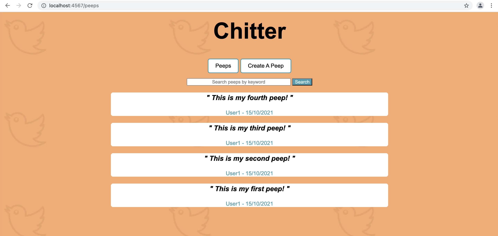
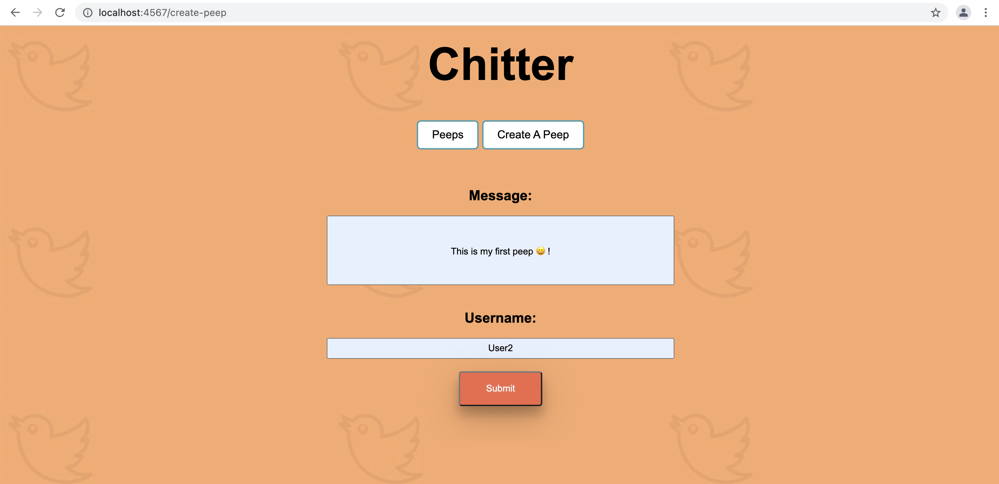
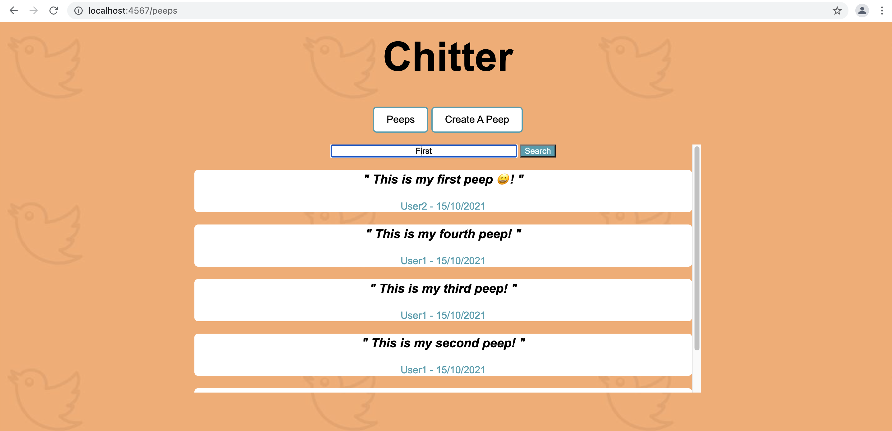
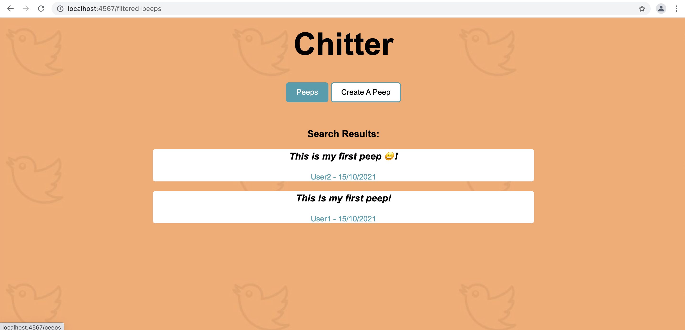

## Chitter Challenge

 Table of Contents
-----
* [Task](#task)
* [User Stories](#user-stories)
* [Installation](#installation)
* [How To Run Tests](#how-to-run-tests)
* [How To Use The Application](#how-to-use-the-application)
* [Built Using](#built-using)

Task
-----
The task for this challenge was to create a  small Twitter clone web application that will allow users to post messages to a public stream web application. The web application should use Object Oriented Programming (OOP) and a Test Driven Development (TDD) approach. In addition, the application was to be tested using Capybara and Sinatra. The user stories below outline all  requirements for this challenge.

Similar to previous challenges, my approach to this challenge was to work through each individual user story, breaking each component down into the simplest requirement to create each class and method as needed, while applying the **RED, GREEN, REFACTOR** method in parallel. This method requires a test to be created initially to define what each element of the application should be doing, running the test to ensure they are failing in the intended way, then developing the feature using the test requirements. Once the feature is working correctly and the tests are passing, I then revisited my code to improve implementation, readability for better maintainability, and overall scalability.

User Stories
-----

```
As a Maker
So that I can see what people are doing
I want to see all the messages (peeps)
in a browser

As a Maker
So that I can let people know what I am doing  
I want to post a message (peep) to chitter

As a Maker
So that I can see when people are doing things
I want to see the date the message was posted

(Hint the database table will need to change to store the date too)

As a Maker
So that I can easily see the latest peeps
I want to see a list of peeps in reverse chronological order

As a Maker
So that I can find relevant peeps
I want to filter on a specific keyword
```

Installation
-----
* Fork this repo
* Run the command 'bundle' in the project directory to ensure you have all the gems


To setup the database (this is required for running the application in your browser):

* Connect to psql in your preferred terminal
* Create the database using the psql command `CREATE DATABASE chitter;`
* Connect to the database using the psql command `\c chitter;`
* Run the query saved in the file 01_create_chitter_table.sql
* Populate your table with a row by running `INSERT INTO peeps (message, username, date) values ('This is a peep!', 'User1', '15/10/2021');`

To check you have everything set up ok, please take a look at the peeps table inside the chitter database by using the psql command `SELECT * FROM peeps;`

You should see one row in there that resembles the bellow:

```
  id |         message          | username |    date    
-----+--------------------------+----------+------------
  1  |     This is a peep!      |  User1   | 15/10/2021
```


To setup the test database (this is required for running tests):
* Connect to psql in your preferred terminal
* Create the database using the psql command `CREATE DATABASE chitter_test;`;
* Connect to the database using the psql command `\c chitter_test`
* Run the query saved in the file 01_create_chitter_table.sql

How To Run Tests
-----
Once `bundle` has been ran, to test the application,

1. Open the application directory `/chitter-challenge-apprenticeships` using your preferred terminal.
2. Run `rspec`.

In your terminal, you should see the below: 

```
............
Have you considered running rubocop? It will help you improve your code!
Try it now! Just run: rubocop


Finished in 0.17055 seconds (files took 0.4333 seconds to load)
12 examples, 0 failures


COVERAGE: 100.00% -- 125/125 lines in 11 files
```

How To Use The Application
-----

1. Open the application directory `/rps-challenge-apprenticeships` using your preferred terminal.
2. Run `rackup -p 4567`.

You should see something that resembles the below in your terminal:

```
[2021-10-15 13:37:12] INFO  WEBrick 1.7.0
[2021-10-15 13:37:12] INFO  ruby 3.0.2 (2021-07-07) [arm64-darwin20]
[2021-10-15 13:37:12] INFO  WEBrick::HTTPServer#start: pid=46276 port=4567
```

3. In your browser, navigate to `http://localhost:4567/`

In your browser you should see this page (note the content displayed on this page will vary depending in what is in your chitter database):


4. To create a peep, click the `Create A Peep` button, enter your message and username on the `/create-peep` page, click submit to be redirected to the `/peeps` page to view your peep at the top of the peep feed.


5. To filter peeps for certain content, on the `/peeps` page, type the keyword into the search box and click the 'search' button. The peeps that contain that word will be displayed on a separate search page. To return back to the original 'peeps' page, click the 'Peeps' button at the top of the page.




Built Using
-----

* Ruby
* Sinatra
* Capybara
* RSpec
* Simplecov
* Rubocop