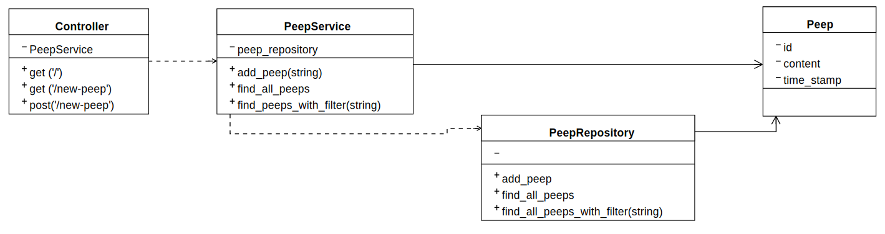
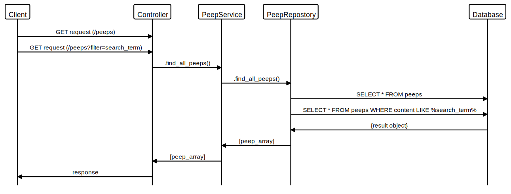

# Chitter

This application is a clone of Twitter. It has a full suite of tests, including 100% code coverage unit tests and feature tests.

## Planning

I have planned this app out with a number of diagrams to help the process:

### Class diagram:



### Peep sequence diagram:



I built the app using TDD. First I would write a feature test to cover a user story, then by adding individual unit tests along the process I could maintain a fully tested codebase while adding the functionality to pass the feature test.

I maintained the Single Responsibility principle throughout all my classes. Each class has a specific functionality and using dependency injection I pass all dependencies into the classes without the need for a class to create the instance itself.

## User Stories:

```
As a Maker
So that I can see what people are doing
I want to see all the messages (peeps)
in a browser
```

```
As a Maker
So that I can let people know what I am doing
I want to post a message (peep) to chitter
```

```
As a Maker
So that I can see when people are doing things
I want to see the date the message was posted
```

```
As a Maker
So that I can easily see the latest peeps
I want to see a list of peeps in reverse chronological order
```

```
As a Maker
So that I can find relevant peeps
I want to filter on a specific keyword
```
