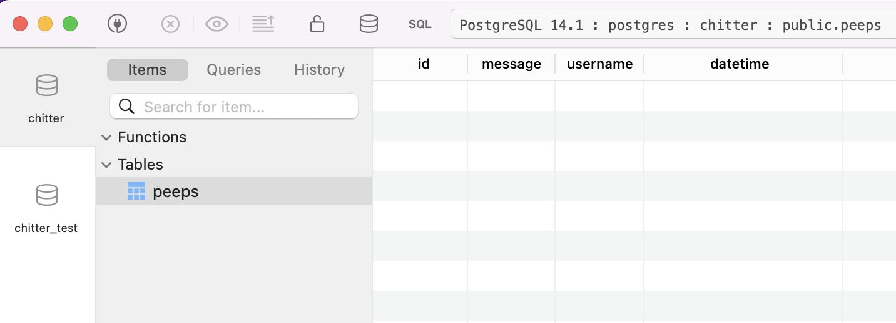
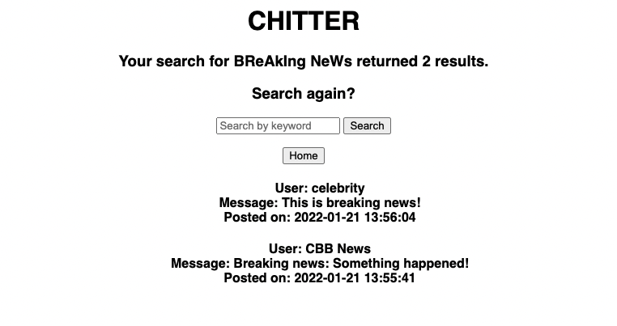

# Chitter Challenge

## Motivation
This project enables a user to send messages (peeps) to an online message board, as well as search for existing messages by keyword.  
  
It is intended to satisfy the following user stories:  
> As a Maker,  
> So that I can see what people are doing,  
> I want to see all the messages (peeps),  
> in a browser.

> As a Maker,  
> So that I can let people know what I am doing,  
> I want to post a message (peep) to chitter.

> As a Maker,  
> So that I can see when people are doing things,  
> I want to see the date the message was posted.

> As a Maker,  
> So that I can easily see the latest peeps,  
> I want to see a list of peeps in reverse chronological order.

> As a Maker,  
> So that I can find relevant peeps,  
> I want to filter on a specific keyword.

## Features
Users can submit peeps to the message board, where they are attributed to a user's name. Once submitted, peeps are presented in the order of most recent first.  
Users can also search the peeps database using the 'search by keyword' functionality, which is case-insensitive.

## How to Use

#### Installation
1. Fork the repo on github, or clone it using the terminal command `git clone https://github.com/marcusventin/chitter-challenge-apprenticeships`.
2. Run `bundle install` in the terminal to install the necessary gems.
3. Create the project databases:
  - Run `psql` in your terminal.
  - Run `CREATE DATABASE chitter` to create a new database.
      - Don't forget to create a test database too!
  - Run the query saved in ./db/migrations/01_create_chitter_table.sql
  - Run the query saved in ./db/migrations/02_add-datetime_column.sql
    - This is what your database should look like in TablePlus once setup is complete:
      
4. To start the program, run `app ruby.rb` in the terminal and visit http://localhost:4567/
  - Alternatively, run `rackup` and visit http://localhost:9292/

#### Homepage
Upon starting the program, you will be greeted with the following page.  
  
Fill in the 'Enter username' and 'Enter peep' inputs and click 'Send' to send your first peep! You should be greeted with a page like this:  
  
As you post more peeps, you will see that your most recent posts are displayed first.
  
#### Search
Use the search function to filter tweets by keyword (speeling mattters but this functionality is case insensitive). See below for a screenshot of a search for 'breaking news':
  

From the results page, you can either search again or return to the homepage.


## Project Diagram
  


* Challenge time: until the end of the day
* Feel free to use google, your notes, books etc but please work on your own
* Please raise a pull request when you start this challenge, and keep pushing updates as and when you make commits throughout the day
* There is _no expectation_ to finish all or any of the user stories, please use this time to reflect on where you feel you are with the skill and what may support your learning.
* If you get blocked, please reflect on what blocked you and any strategies you adopted that helped you make progress.

We are going to write a small Twitter clone that will allow the users to post messages to a public stream.

## Set up

To setup the database:

* Connect to psql
* Create the database using the psql command `CREATE DATABASE chitter;`
* Connect to the database using the psql command `\c chitter`;
* Run the query we have saved in the file 01_create_chitter_table.sql
* Populate your table with a row by running `INSERT INTO peeps (message) values ('This is a peep!');`

To check you have everything set up ok, please take a look at the peeps table inside the chitter database. You should see one row in there.  

To setup the test database:
* Connect to psql
* Create the database using the psql
command `CREATE DATABASE chitter_test;`;
* Connect to the database using the psql command `\c chitter_test`
* Run the query we have saved in the file 01_create_chitter_table.sql

* `bundle install`
* `rspec`

You should see 1 passing test.

## User stories

```
As a Maker
So that I can see what people are doing
I want to see all the messages (peeps)
in a browser
```

```
As a Maker
So that I can let people know what I am doing  
I want to post a message (peep) to chitter
```

```
As a Maker
So that I can see when people are doing things
I want to see the date the message was posted
```
(Hint the database table will need to change to store the date too)

```
As a Maker
So that I can easily see the latest peeps
I want to see a list of peeps in reverse chronological order
```
```
As a Maker
So that I can find relevant peeps
I want to filter on a specific keyword
```
